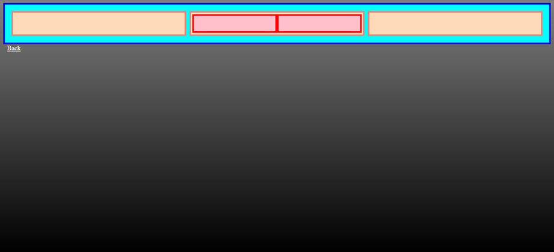
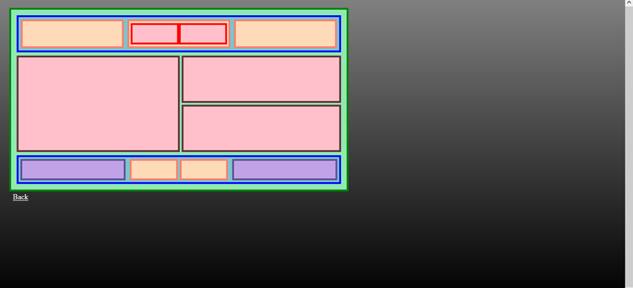

# Project Name

> This is a project in order to perfect the use of flexbox and some tools necessary for the organization of boxes.

third exercise

## Built With

- HTML
- CSS

## Live Demo

[Live Demo Link](https://jhoadsonmijares12.github.io/introductiontoflexbox/)

## Getting Started

**This is an example of how you may give instructions on setting up your project locally.**
**Modify this file to match your project, remove sections that don't apply. For example: delete the testing section if the currect project doesn't require testing.**

## Author

👤 **Jhony Jhoadson Mijares Gonzalez**

- GitHub: [@jhoadsonmijares12](https://github.com/jhoadsonmijares12)
- Instagram: jhoadsonmijares

## 🤝 Contributing

The properties of flexbox, margin, height, align-item, among others, are used.

-https://www.theodinproject.com/lessons/foundations-introduction-to-flexbox
-https://www.theodinproject.com/lessons/foundations-alignment
-https://www.joshwcomeau.com/css/interactive-guide-to-flexbox/
-https://flexbox.malven.co/

## Show your support

Give a ⭐️ if you like this project!

## 📝 License

This project is [CC0 1.0 Universal](LICENSE) licensed.